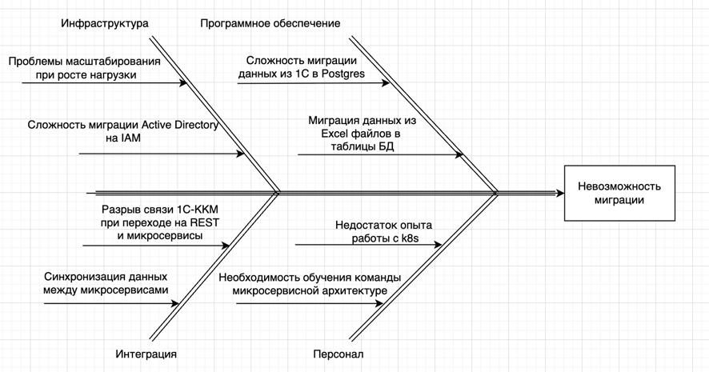

# Оценка узких мест при миграции

## Ключевые процессы и компоненты при миграции

Базы данных: Миграция с файлов и 1С (Бухгалтерия, Торговля и склад) на Postgres для транзакционных данных и ClickHouse для аналитики.
Коммуникация: Переход с OLE-интеграции 1С-ККМ на REST API. Требуется обеспечить непрерывность работы касс в процессе миграции.
Инфраструктура: Миграция с Windows Server на Kubernetes. Необходимо обеспечить масштабируемость для роста нагрузки.
Бизнес-логика: Перевод ручных процессов (Excel, сканы) в микросервисы: портал клиентов, CRM, платёжный шлюз, интеграция с лабораторией.

## Диаграмма Исикавы
 

## Возможные проблемы и решения

| Проблема                                                                      | Решение                                                                                                                                              | 
|-------------------------------------------------------------------------------|------------------------------------------------------------------------------------------------------------------------------------------------------|
| Сложность миграции из 1С                                                      | Постепенный вынос функционала и данных в соответствующие микросервисы с покрытием кода тестами                                                       |
| Недостаточная производительность при росте нагрузки                           | Внедрить горизонтальное масштабирование (HPA)                                                                                                        |
| У команды нет навыков работы с распределенными системами                      | Обучение команды, расширение состава                                                                                                                 |
| Нарушение требований по защите персональных данных                            | Внедрить разграничение прав доступа к данным по RBAC/ABAC, а также шифрование данных AES-256. Настроить аудит всех операций с данными и проверки DLP |
| Сложнее сопровождать распределенную систему, особенно при повышенной нагрузке | Добавить трейсинг, сбор метрик, централизованное логирование, внедрить подход IaC(infrastructure as code), поддерживать актуальной документацию      |

